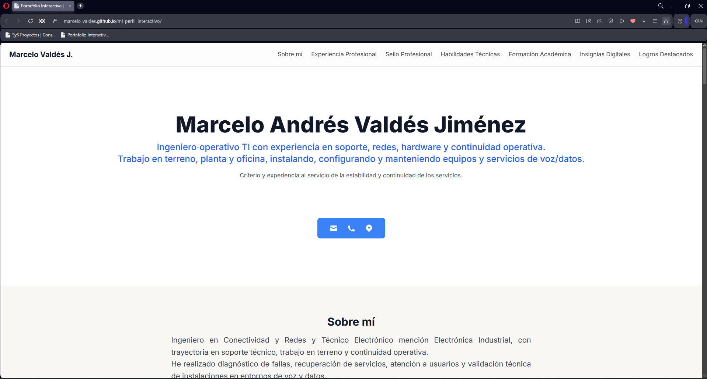

# Portafolio Interactivo – Marcelo Andrés Valdés Jiménez

Este repositorio contiene el código fuente de mi portafolio profesional, desarrollado en un único archivo HTML que incluye estilos, scripts e imágenes embebidas.  
El sitio presenta mi experiencia, habilidades técnicas y trayectoria profesional de forma interactiva y responsiva.

🔗 **Portafolio en línea:**  
https://marcelo-valdes.github.io/mi-trayectoria-tecnica/

---

## 🖼️ Vista previa del portafolio

---

## 🧰 Tecnologías utilizadas
- HTML5  
- CSS3 (estilos internos)  
- JavaScript (scripts internos)  
- Chart.js (via CDN)  
- Tailwind CSS (via CDN)  
- Git & GitHub Pages  

---

## 📁 Estructura del proyecto

mi-perfil-interactivo/

└── index.html

---

## 🚀 Cómo visualizar el portafolio
Puedes acceder al sitio directamente desde GitHub Pages:

**https://marcelo-valdes.github.io/mi-trayectoria-tecnica**

Si deseas ejecutarlo localmente:
1. Clona este repositorio  
2. Abre `index.html` en tu navegador  

---

## 📌 Descripción general
El portafolio incluye:
- Sección de presentación personal  
- Experiencia y trayectoria profesional  
- Habilidades técnicas  
- Gráficos dinámicos con Chart.js  
- Modales informativos  
- Diseño responsivo con Tailwind CSS  
- Recursos visuales integrados directamente en el HTML  

---

## 👨‍💻 Autor
**Marcelo Andrés Valdés Jiménez**  
Talca, Región del Maule, Chile  
GitHub: https://github.com/Marcelo-Valdes  
Email: marcelo.valdes.j@gmail.com
